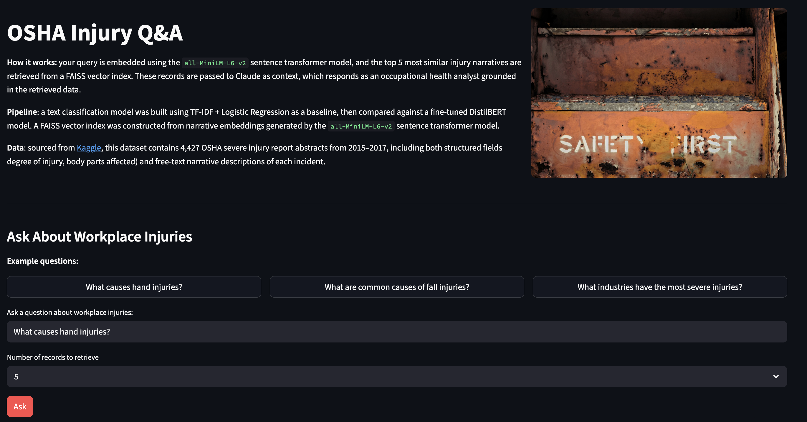
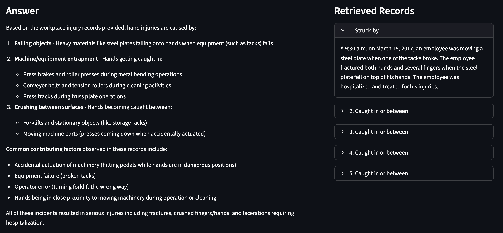

# Injury Intelligence

An NLP pipeline over OSHA Severe Injury Reports (2015–2017), combining text classification and a RAG-powered Q&A interface.

---

## What it does

- **EDA**: explores OSHA injury narratives, cleans and lemmatizes text, analyzes class distributions
- **Classification**: trains a TF-IDF + Logistic Regression baseline and a fine-tuned DistilBERT model to classify injury event types. Experiments tracked with MLflow.
- **RAG Q&A**: embeds narratives using `all-MiniLM-L6-v2` and stores them in a FAISS vector index. User queries are embedded and matched against the index, with retrieved records passed to Claude as context for grounded answers.
- **Streamlit app**: interactive interface for querying the dataset in plain English

[](https://www.python.org/)
[](https://pandas.pydata.org/)
[](https://scikit-learn.org/)
[](https://huggingface.co/)
[](https://mlflow.org/)
[](https://faiss.ai/)
[](https://www.anthropic.com/)
[](https://osha-injury-intelligence.streamlit.app)

---

## Live Demo

View the live demo at [https://osha-injury-intelligence.streamlit.app/](https://osha-injury-intelligence.streamlit.app/)

### Screenshots




---

## Project Structure

```
injury-intelligence/
├── app/
│   ├── assets/
│   │   └── safety_first.jpg
│   └── app.py                  # Streamlit RAG interface
├── notebooks/
│   ├── 1_eda.ipynb             # Data exploration and preprocessing
│   ├── 2_classification.ipynb  # TF-IDF + DistilBERT classification
│   └── 3_rag.ipynb             # Embeddings, FAISS index, RAG pipeline
├── data/                       # Raw and processed data (raw gitignored)
├── mlruns/                     # MLflow experiment tracking (gitignored)
└── README.md
```

--- 

## Data

[OSHA Accident and Injury Data](https://www.kaggle.com/datasets/ruqaiyaship/osha-accident-and-injury-data-1517) via Kaggle. Contains 4,427 severe workplace injury records with free-text narrative descriptions.